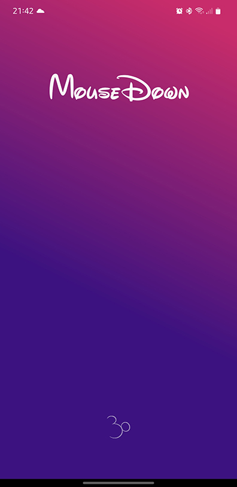
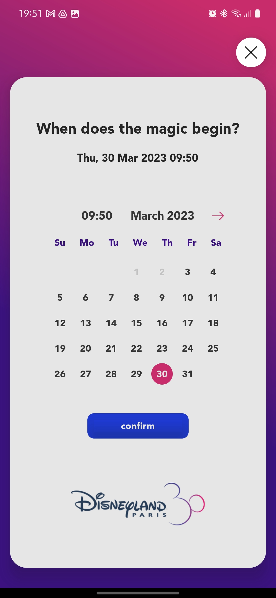
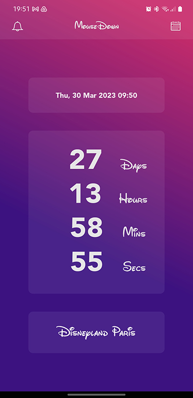
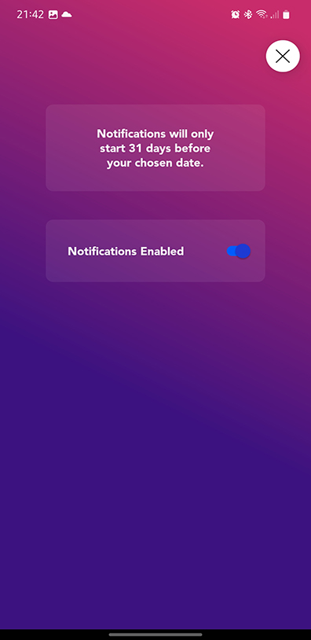

# MouseDown Screens
A React Native app built with Async Storage, React Native Navigation and Local Notifications.  

The app's purpose is to set a date and a timer will countdown the day's, hours and minutes. Each day within 31 days of the user's chosen date, a local notification will be sent. 

# Splash Screen

# Calendar Screen

# Countdown Screen

# Notifications Screen

# Final Screen
